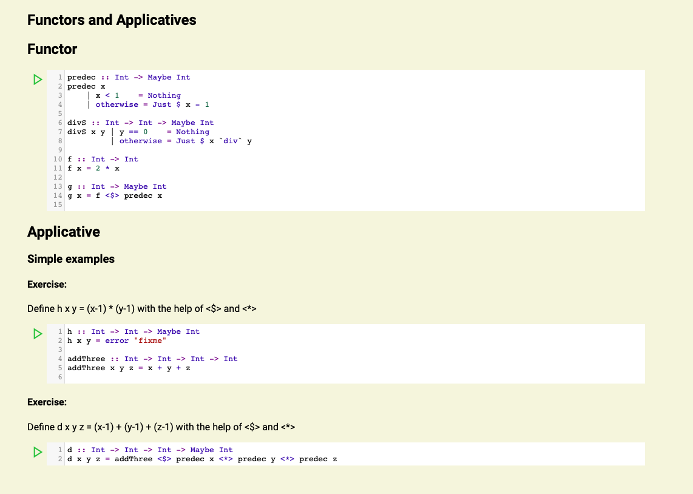

# haskell-notebook

Can be used to present a haskell file as notebook in the browser. 
Like known from Jupyter Notebooks code can be executed and edited within the notebook.

## Usage
- extract html
    - `cd htmlExtractor`
    - `stack run`
        - `-s`: haskell file to convert, default "testData/codebook.hs"
        - `-t`: template html file, default "../webNotebook/template.html"
        - `-o`: output file, default "../webNotebook/index.html"
        - example: `stack run -- -s "testData/Part-5-Todo.hs" -t "../webNotebook/template.html" -o "../webNotebook/src/index.html"`
- run backend
    - `cd ./backend`
    - `stack run` => server available under port 8000
- run frontend
    - `cd ./webNotebook`
    - `yarn serve`